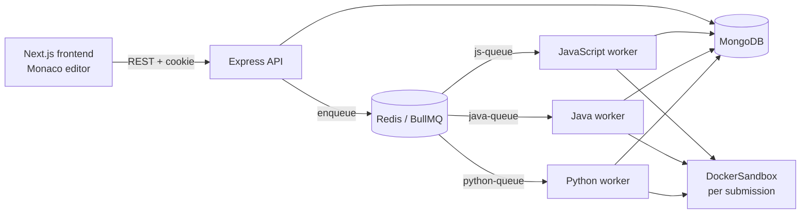

# Koder

Koder is a full-stack online judge for function-signature programming problems. Authenticated users can write and submit JavaScript, Java, or Python solutions; language-specific workers execute submissions against sample and hidden test cases in isolated Docker containers and persist the resulting verdict.

## Table of Contents

- [Architecture Overview](#architecture-overview)
- [Submission Flow](#submission-flow)
- [Supported Languages](#supported-languages)
- [DockerSandbox and Isolation](#dockersandbox-and-isolation)
- [Resource Limits and Verdicts](#resource-limits-and-verdicts)
- [Queue Architecture](#queue-architecture)
- [Project Structure](#project-structure)
- [Environment Configuration](#environment-configuration)
- [Local Development](#local-development)
- [Docker Compose Infrastructure](#docker-compose-infrastructure)
- [Testing Strategy](#testing-strategy)
- [Current Verification Status](#current-verification-status)
- [Design Decisions](#design-decisions)
- [Limitations](#limitations)
- [License](#license)

## Architecture Overview



The frontend, backend, and workers run on the host during local development. Docker Compose supplies MongoDB and Redis only. `DockerSandbox` creates separate, short-lived containers for untrusted submission code.

The backend exposes `/api/v1` routes for authentication, users, questions, and submissions, plus `/admin` routes protected by authentication and an admin-role check. Shared models, queue configuration, language configuration, verdict constants, protocol helpers, runner generation, and worker database operations are in the `@koder/shared` workspace package.

## Submission Flow

1. The frontend sends `{ language, code }` to `POST /api/v1/submissions/:questionId` with the authentication cookie.
2. The API validates the language, creates a submission with `pending` status, and adds an `execute` job containing its ID to the matching BullMQ queue.
3. The matching worker loads the submission and question, generates the runner source, creates a namespaced sandbox directory, and starts a Docker container.
4. Java submissions compile with `javac Main.java`; JavaScript and Python run directly.
5. The worker streams test cases to the runner and records the first failure or an accepted result in MongoDB.
6. The worker force-removes the container and removes the sandbox directory in its cleanup path. Containers also use Docker's `--rm` as a fallback after their idle watchdog exits. The frontend polls `GET /api/v1/submissions/:submissionId` for the completed submission.

## Supported Languages

| Language | Docker image | Source file | Command | Queue |
| --- | --- | --- | --- | --- |
| JavaScript | `node:20-alpine` | `app.js` | `node app.js` | `js-queue` |
| Java | `eclipse-temurin:17-jdk-alpine-3.23` | `Main.java` | `javac Main.java`, then `java Main` | `java-queue` |
| Python | `python:3.11-alpine` | `solution.py` | `python -u solution.py` | `python-queue` |

`SUPPORTED_LANGUAGES` in `packages/shared/config/languages.js` defines the three accepted values: `javascript`, `java`, and `python`. The frontend selector, question starter code, submission validation, queues, and workers use this contract. Python is implemented end to end, including starter-code generation, a runner, queue dispatch, and a worker.

## DockerSandbox and Isolation

`workers/common/dockerSandbox.js` creates one detached container for each submission. It uses `docker exec -i` to run a language runner and stream a batch of test cases through the Base64 Line Streaming Protocol (BLSP). Requests use `<caseId> <base64(input)>`; responses use `<caseId> <OK|ERROR|FATAL_ERROR> <base64(payload)>`. The line framing keeps test-case payloads separate from protocol delimiters.

The sandbox is configured with these Docker controls:

| Control | Implemented setting |
| --- | --- |
| Network | `--network none` |
| Linux capabilities | `--cap-drop ALL` |
| Privilege escalation | `--security-opt no-new-privileges` |
| Syscall policy | Docker's built-in seccomp profile |
| Runtime user | `--user 1000:1000` |
| Root filesystem | `--read-only` |
| Temporary filesystem | `--tmpfs /tmp:size=64m` |
| Work directory | writable bind mount of the per-job directory at `/app` |

On timeout or execution cleanup, the sandbox attempts to kill matching `node`, `java`, `javac`, and `python` processes before the container is removed.

For Java runners, the generated harness also installs a narrow `SecurityManager`
guard after the JVM has started. It denies normal Java APIs for child-process
creation, environment-variable lookup, filesystem access outside `/app`, and
socket access. This is defense in depth only: the Docker container is the
security boundary. The guard is retained because Docker seccomp cannot deny
`execve` for a `docker exec` process without also preventing the JVM from
starting. It must not be treated as a substitute for container isolation.

### Cross-language sandbox isolation

BullMQ job IDs are scoped to a queue, so different language queues can each produce the same numeric ID. The execution engine prevents directory collisions by using a key containing both language and job ID, such as `javascript-1` or `python-1`. `createSandbox` validates that key and verifies that its resolved path remains under `workers/common/temp`.

## Resource Limits and Verdicts

`DockerSandbox` and the execution engine apply the following defaults:

| Resource | Limit / behavior |
| --- | --- |
| Memory | `--memory=256m` |
| CPU | `--cpus=1` |
| Processes | `--pids-limit=64` |
| `/tmp` | `64m` tmpfs |
| Idle container lifetime | 120 seconds (`sleep`) |
| Per-test-case watchdog | 2,000 ms |
| Overall submission deadline | 45,000 ms |
| Java compilation watchdog | 25,000 ms |
| Captured stdout/stderr buffer | 5 MiB |
| Batch size | 50 test cases |

The shared verdict contract defines `Accepted`, `Wrong Answer`, `Runtime Error`, `Time Limit Exceeded`, `Compilation Error`, and `Memory Limit Exceeded`. The engine currently assigns the first five: compilation errors apply to Java, timeouts are enforced by the watchdogs, and a process failure or non-`OK` runner response is a runtime error. It stops at the first failing test case. Output comparison first normalizes surrounding whitespace and line endings, then also supports JSON-equivalent values, boolean case normalization, and sequence-style whitespace/comma formatting.

The container memory cgroup is enforced at 256 MiB. An allocation failure is
currently reported as a runtime failure rather than a distinct memory verdict;
the limit prevents the allocation from escaping the container.

## Queue Architecture

`packages/shared/config/queues.js` is the single source of truth for queue names and Redis connection settings:

- `js-queue`
- `java-queue`
- `python-queue`

The backend creates BullMQ `Queue` producers and adds `execute` jobs. Each language worker creates a BullMQ `Worker` for its own queue. No concurrency option is passed to the BullMQ workers, so each worker process uses BullMQ's default concurrency of 1.

If a job processor fails unexpectedly, `workerFactory` updates the associated submission with `Runtime Error`, or `Time Limit Exceeded` when the error signals a timeout.

## Project Structure

```text
.
├── backend/                 Express API, routes, middleware, queue producers, seed/admin scripts
├── frontend/                Next.js App Router frontend and Monaco editor integration
├── workers/
│   ├── common/              DockerSandbox, execution engine, sandbox lifecycle, worker factory
│   ├── javascript/          JavaScript executor and worker
│   ├── java/                Java executor and worker
│   └── python/              Python executor and worker
├── packages/shared/         Shared models, configuration, contracts, runner generation, DB helpers
├── docker-compose.yml       MongoDB and Redis local infrastructure
├── .env.example             Local environment template
├── DOCKER.md                Docker Compose notes
└── ISSUES.md                Issue and implementation history
```

## Environment Configuration

Copy the template at the repository root before starting the backend or workers:

```powershell
Copy-Item .env.example .env
```

```env
MONGODB_URI=mongodb://127.0.0.1:27017/koder
REDIS_HOST=127.0.0.1
REDIS_PORT=6379
JWT_SECRET=replace-with-a-local-development-secret
NEXT_PUBLIC_BACKEND_URL=http://localhost:5000
```

`backend/server.js` loads the root `.env`; `workers/common/workerFactory.js` does the same. The frontend's `NEXT_PUBLIC_BACKEND_URL` is provided through its environment when Next.js starts.

### Seed and admin scripts

The root `.env` is **not sufficient** for `backend/seedProblems.js` or `backend/promoteAdmin.js`. Both scripts explicitly load `backend/.env`. Copy the template there as well before running either script:

```powershell
Copy-Item .env.example backend/.env
```

`backend/.env` is ignored by Git. Keep the connection values in it aligned with the root `.env`.

## Local Development

Prerequisites: Node.js and npm, Docker Desktop (or Docker Engine), Docker Compose, and the Docker CLI on `PATH`. The following commands are PowerShell-compatible and should be run from the repository root.

```powershell
Copy-Item .env.example .env
Copy-Item .env.example backend/.env
docker compose up -d mongo redis
npm install
node backend/seedProblems.js
```

Start these processes in separate terminals:

```powershell
npm run dev:backend
npm run worker:js
npm run worker:java
npm run worker:python
npm run dev --workspace=frontend
```

The backend listens on `http://localhost:5000`; the frontend development server uses `http://localhost:3000`. All three language workers must be running to process all supported submission types.

To promote an existing user to administrator:

```powershell
node backend/promoteAdmin.js user@example.com
```

## Docker Compose Infrastructure

`docker-compose.yml` runs only the shared local infrastructure:

| Service | Image | Host binding | Persistent data |
| --- | --- | --- | --- |
| MongoDB | `mongo:8` | `127.0.0.1:27017` | `mongo-data` |
| Redis | `redis:7-alpine` | `127.0.0.1:6379` | `redis-data` |

MongoDB has a `mongosh` ping health check. Redis uses append-only persistence and a `redis-cli ping` health check. Both bind to loopback. Compose does not run the frontend, backend, or workers, and it does not mount the Docker socket or use privileged containers.

```powershell
docker compose up -d mongo redis
docker compose down
```

`docker compose down -v` also deletes the named database and Redis volumes.

## Testing Strategy

The project uses Node scripts and built-in `assert`; it does not use an external test framework.

| Command | Scope | Verified by package script |
| --- | --- | --- |
| `npm test` | root | backend and worker CI-safe suites |
| `npm run test:ci` | root | same as `npm test` |
| `npm run test:ci --workspace=backend` | backend | five backend test scripts |
| `npm run test:ci --workspace=workers` | workers | `test_execution_engine.js` |
| `npm run test:docker --workspace=workers` | workers | `test_python_docker.js`; requires Docker |
| `npm run test:security --workspace=workers` | workers | `test_java_sandbox_security.js`; requires Docker and checks Java API guards, resource limits, and cleanup |
| `npm run test:smoke --workspace=workers` | workers | manual Docker/MongoDB smoke scripts |

`workers/test_sandbox_collision_docker.js` directly checks the cross-language sandbox collision fix, but it is not included in a package script. Run it manually when Docker is available:

```powershell
node workers/test_sandbox_collision_docker.js
```

## Current Verification Status

`ISSUES.md` marks ISSUE-001 through ISSUE-015 as complete. This includes authentication and password-hash protections, the shared workspace contract, the unified execution engine, sandbox hardening, CI-safe tests, Docker Compose infrastructure, end-to-end Python support, and the cross-language sandbox collision fix. Configurable worker concurrency and horizontal scaling are recorded as deferred capacity work, not open implementation issues.

## Design Decisions

- **Shared workspace contract:** backend and worker code share models, queue/language configuration, protocols, runner generation, and database helpers through `@koder/shared`.
- **One container per submission:** the worker starts one container and streams a batch of test cases to a single runner process instead of creating a container per test case.
- **Function-signature questions:** `functionName`, parameters, and return type drive per-language starter-code and runner generation.
- **Selected containerization:** Compose isolates local MongoDB and Redis; DockerSandbox isolates untrusted code; application services remain host-run for local development.
- **Fail-fast judging:** execution stops when the first test case fails.

## Limitations

- Worker concurrency is the BullMQ default of one job per language worker process; configurable concurrency and horizontal scaling are not implemented.
- Docker enforces the memory cap, but the engine does not measure memory usage or assign `Memory Limit Exceeded`; an out-of-memory failure can surface as a runtime error.
- The Docker daemon is part of the trusted computing base. Run workers only on a host where the daemon is not exposed to untrusted users, keep Docker's built-in seccomp/AppArmor (or equivalent) enabled, and do not add host mounts, Docker-socket mounts, host networking, or privileged mode to submission containers.
- `seedProblems.js` and `promoteAdmin.js` require `backend/.env` in addition to the root `.env` workflow.
- `test_sandbox_collision_docker.js` is manual rather than wired into an npm script.
- No CI workflow is present in the repository.
- Authentication routes do not implement rate limiting or account lockout.

## License

This repository is licensed under the [MIT License](LICENSE).
